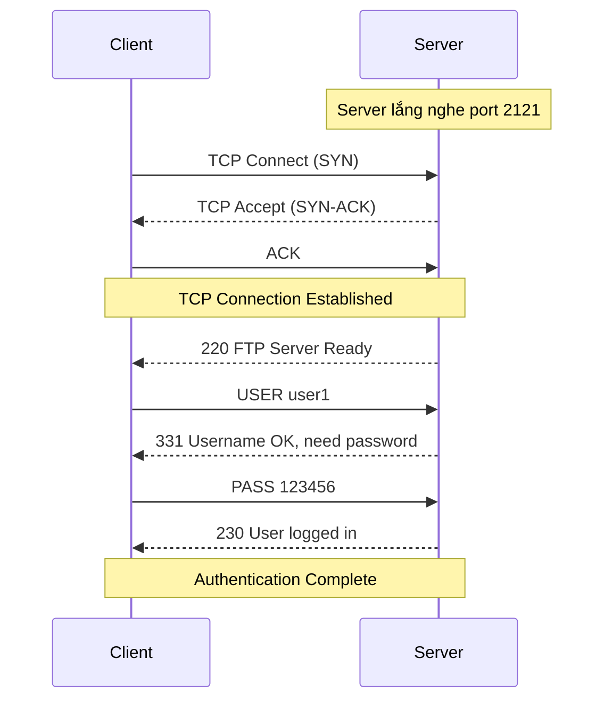
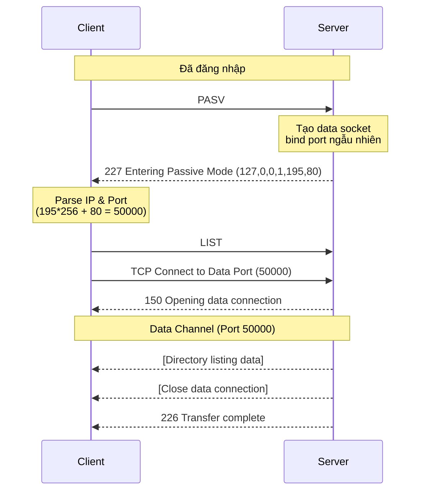
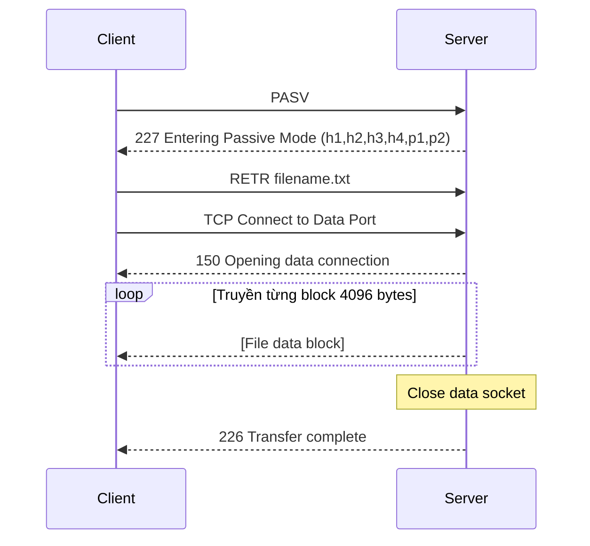
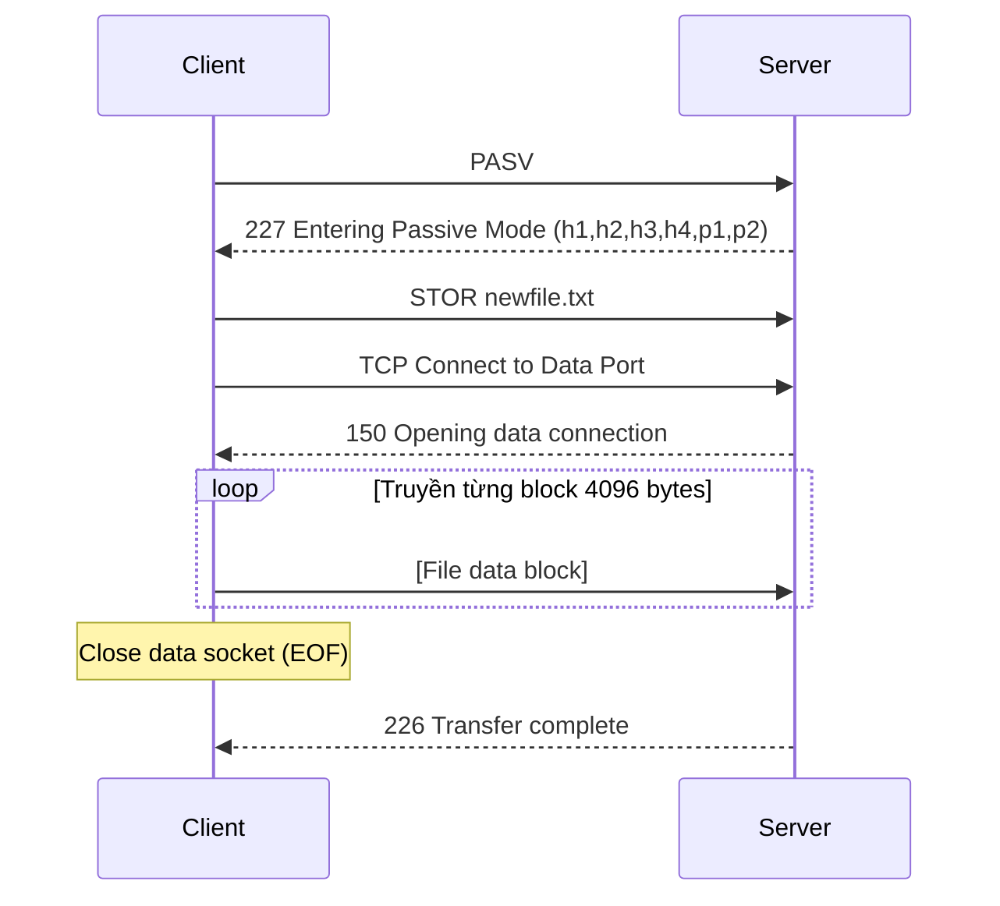
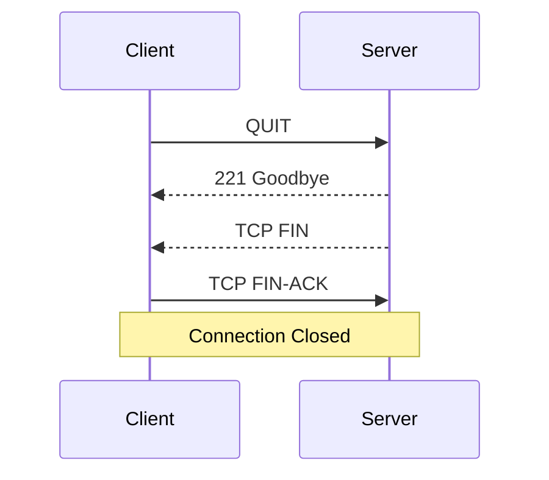

# BÁO CÁO DỰ ÁN FTP CLIENT-SERVER

## 1. Thông tin chung

### 1.1 Tên đề tài
**Xây dựng ứng dụng FTP Client-Server sử dụng Socket TCP**

### 1.2 Thành viên nhóm

| Thành viên | Phần phụ trách |
|------------|----------------|
| **Cuong** (Leader) | FTP Server core, socket, đa client, control connection |
| **Huy** | Quản lý tài khoản, file system, bảo mật thư mục |
| **Chien** | Data connection, upload/download, FTP Client |

---

## 2. Mô tả giao thức

### 2.1 Giao thức cơ bản

| Thông số | Giá trị |
|----------|---------|
| **Giao thức mạng** | TCP/IP |
| **Tiêu chuẩn** | RFC 959 (File Transfer Protocol) |
| **Port Server mặc định** | 2121 |
| **Port Client** | Ephemeral port (được OS cấp động) |
| **Chế độ truyền dữ liệu** | Passive Mode (PASV) |
| **Hỗ trợ đồng thời** | Multi-threaded (1 thread/client) |

### 2.2 Các kết nối FTP

FTP sử dụng **2 kênh kết nối riêng biệt**:

```
┌─────────────────┐                      ┌─────────────────┐
│   FTP CLIENT    │                      │   FTP SERVER    │
│                 │                      │                 │
│  ┌───────────┐  │   Control Channel    │  ┌───────────┐  │
│  │  Control  │◄─┼──────(Port 2121)─────┼─►│  Control  │  │
│  │  Socket   │  │       (TCP)          │  │  Socket   │  │
│  └───────────┘  │                      │  └───────────┘  │
│                 │                      │                 │
│  ┌───────────┐  │    Data Channel      │  ┌───────────┐  │
│  │   Data    │◄─┼───(PASV Port)────────┼─►│   Data    │  │
│  │  Socket   │  │      (TCP)           │  │  Socket   │  │
│  └───────────┘  │                      │  └───────────┘  │
└─────────────────┘                      └─────────────────┘
```

| Kênh | Mô tả | Cổng |
|------|-------|------|
| **Control Channel** | Gửi/nhận lệnh FTP và response | Server: 2121, Client: ephemeral |
| **Data Channel** | Truyền dữ liệu file, danh sách thư mục | Server: dynamic (PASV), Client: ephemeral |

---

## 3. Cấu trúc dữ liệu

### 3.1 FTP Session (Server)

```c
typedef struct {
    int session_id;             /* ID phiên duy nhất */
    int ctrl_sock;              /* Socket điều khiển */
    int logged_in;              /* Trạng thái đăng nhập */
    int account_index;          /* Chỉ số tài khoản */
    char username[50];          /* Tên người dùng */
    char current_dir[256];      /* Thư mục hiện tại */
    char root_dir[256];         /* Thư mục gốc (chroot) */
    struct sockaddr_in client_addr;  /* Địa chỉ client */
    int data_listen_sock;       /* Socket lắng nghe dữ liệu */
    int data_sock;              /* Socket kết nối dữ liệu */
} FTPSession;
```

### 3.2 FTP Client

```c
typedef struct {
    int ctrl_sock;      /* Socket điều khiển */
    char server_ip[50]; /* Địa chỉ IP server */
    int server_port;    /* Cổng server */
    int logged_in;      /* Trạng thái đăng nhập */
} FTPClient;
```

---

## 4. Đóng gói dữ liệu

### 4.1 Định dạng lệnh FTP (Client → Server)

```
<COMMAND> [<ARGUMENT>]\r\n
```

| Thành phần | Mô tả |
|------------|-------|
| `<COMMAND>` | Lệnh FTP viết hoa (VD: `USER`, `PASS`, `LIST`) |
| `<ARGUMENT>` | Tham số (tuỳ chọn) |
| `\r\n` | Ký tự kết thúc (Carriage Return + Line Feed) |

**Ví dụ:**
```
USER user1\r\n
PASS 123456\r\n
CWD documents\r\n
RETR file.txt\r\n
```

### 4.2 Định dạng phản hồi (Server → Client)

```
<CODE> <MESSAGE>\r\n
```

| Thành phần | Mô tả |
|------------|-------|
| `<CODE>` | Mã phản hồi 3 chữ số (theo RFC 959) |
| `<MESSAGE>` | Thông điệp mô tả |
| `\r\n` | Ký tự kết thúc |

**Ví dụ:**
```
220 FTP Server Ready\r\n
331 Username OK, need password\r\n
230 User logged in\r\n
```

### 4.3 Truyền dữ liệu qua Data Channel

| Loại dữ liệu | Định dạng | Kích thước buffer |
|--------------|-----------|-------------------|
| Danh sách file (LIST) | Text format (ls -l style) | 4096 bytes |
| Nội dung file (RETR/STOR) | Binary stream | 4096 bytes/block |

---

## 5. Các lệnh FTP được hỗ trợ

### 5.1 Lệnh xác thực

| Lệnh | Cú pháp | Mô tả | Code thành công | Code lỗi |
|------|---------|-------|-----------------|----------|
| `USER` | `USER <username>` | Gửi tên đăng nhập | 331 | 501 |
| `PASS` | `PASS <password>` | Gửi mật khẩu | 230 | 530, 503 |

### 5.2 Lệnh điều hướng

| Lệnh | Cú pháp | Mô tả | Code thành công | Code lỗi |
|------|---------|-------|-----------------|----------|
| `PWD` | `PWD` | In thư mục hiện tại | 257 | 530 |
| `CWD` | `CWD <path>` | Đổi thư mục | 250 | 530, 550, 501 |
| `CDUP` | `CDUP` | Lên thư mục cha | 250 | 530, 550 |

### 5.3 Lệnh truyền dữ liệu

| Lệnh | Cú pháp | Mô tả | Code thành công | Code lỗi |
|------|---------|-------|-----------------|----------|
| `PASV` | `PASV` | Bật chế độ passive | 227 | 530, 425 |
| `LIST` | `LIST` | Liệt kê thư mục | 226 | 425, 550 |
| `RETR` | `RETR <file>` | Download file | 226 | 425, 550, 426, 450 |
| `STOR` | `STOR <file>` | Upload file | 226 | 425, 550, 426, 450 |
| `TYPE` | `TYPE <A\|I>` | Đặt chế độ truyền | 200 | 504 |

### 5.4 Lệnh hệ thống

| Lệnh | Cú pháp | Mô tả | Code thành công |
|------|---------|-------|-----------------|
| `SYST` | `SYST` | Thông tin hệ thống | 215 |
| `NOOP` | `NOOP` | Giữ kết nối | 200 |
| `QUIT` | `QUIT` | Ngắt kết nối | 221 |

---

## 6. Mã phản hồi FTP (Response Codes)

### 6.1 Phân loại mã phản hồi

| Nhóm | Ý nghĩa |
|------|---------|
| **1xx** | Positive Preliminary - Hành động đang được xử lý |
| **2xx** | Positive Completion - Thành công |
| **3xx** | Positive Intermediate - Cần thêm thông tin |
| **4xx** | Transient Negative - Lỗi tạm thời |
| **5xx** | Permanent Negative - Lỗi vĩnh viễn |

### 6.2 Chi tiết mã phản hồi được triển khai

| Mã | Thông điệp | Mô tả |
|----|------------|-------|
| `150` | Opening data connection | Bắt đầu truyền dữ liệu |
| `200` | OK / Type set to A/I | Lệnh thành công |
| `211` | End | Kết thúc danh sách tính năng |
| `215` | UNIX Type: L8 | Thông tin hệ thống |
| `220` | FTP Server Ready | Server sẵn sàng |
| `221` | Goodbye | Kết thúc phiên |
| `226` | Transfer complete | Truyền xong |
| `227` | Entering Passive Mode (h1,h2,h3,h4,p1,p2) | PASV response |
| `230` | User logged in | Đăng nhập thành công |
| `250` | Directory changed | Đổi thư mục thành công |
| `257` | "path" is current directory | Thư mục hiện tại |
| `331` | Username OK, need password | Cần mật khẩu |
| `425` | Can't open data connection | Lỗi kết nối dữ liệu |
| `426` | Connection closed; transfer aborted | Truyền bị hủy |
| `450` | Requested file action not taken | Lỗi file tạm thời |
| `501` | Syntax error | Lỗi cú pháp |
| `502` | Command not implemented | Lệnh không được hỗ trợ |
| `503` | Login with USER first | Chưa đăng nhập với USER |
| `504` | Type not supported | Type không hỗ trợ |
| `530` | Not logged in / Login incorrect | Chưa đăng nhập / Sai thông tin |
| `550` | Directory/File not found / Permission denied | Không tìm thấy / Từ chối truy cập |

---

## 7. Sequence Diagram

### 7.1 Quá trình kết nối và đăng nhập



### 7.2 Quá trình liệt kê thư mục (LIST)



### 7.3 Quá trình download file (RETR)



### 7.4 Quá trình upload file (STOR)



### 7.5 Quá trình ngắt kết nối



---

## 8. Bảo mật

### 8.1 Chroot giả (Sandboxing)

- Mỗi user có thư mục gốc riêng (`root_dir`)
- Thư mục hiện tại (`current_dir`) là đường dẫn tương đối trong `root_dir`
- Đường dẫn thực tế = `root_dir` + `current_dir`
- Không cho phép `CWD ..` khi đang ở `/`

### 8.2 Quản lý tài khoản

File `accounts.txt`:
```
username password /path/to/home
user1 123456 ./data/user1
user2 password ./data/user2
```

---

## 9. Tương thích

### 9.1 FTP Clients đã test

| Client | Hỗ trợ |
|--------|--------|
| **Custom FTP Client** (dự án) | ✅ Đầy đủ |
| **FileZilla** | ✅ (RFC 959 cơ bản) |
| **Command-line ftp** | ✅ |

### 9.2 Hạn chế

- Chỉ hỗ trợ **Passive Mode** (không có Active Mode)
- Không hỗ trợ **FTPS** (FTP over TLS)
- Không hỗ trợ **Resume** download/upload

---

## 10. Cách chạy ứng dụng

### 10.1 Build

```bash
make all
```

### 10.2 Chạy Server

```bash
./bin/ftp_server [port]
# Mặc định: port 2121
```

### 10.3 Chạy Client

```bash
./bin/ftp_client [host] [port]
# Mặc định: 127.0.0.1:2121
```

### 10.4 Tài khoản mặc định

- **Username:** user1
- **Password:** 123456

---

## 11. Cấu trúc mã nguồn

```
FTP-client-server/
├── server/
│   ├── include/
│   │   ├── account.h       # Quản lý tài khoản
│   │   └── ftp_server.h    # Định nghĩa FTP server
│   ├── src/
│   │   ├── server.c        # Main entry, multi-threading
│   │   ├── ftp_server.c    # Xử lý lệnh FTP
│   │   ├── account.c       # CRUD tài khoản
│   │   └── account_add.c   # Tool thêm tài khoản
│   ├── helpers/
│   │   ├── logger.h        # Logger header
│   │   └── logger.c        # Ghi log
│   └── data/
│       └── accounts.txt    # File tài khoản
├── client/
│   ├── include/
│   │   └── ftp_client.h    # Định nghĩa FTP client
│   └── src/
│       ├── client.c        # Main entry
│       └── ftp_client.c    # Xử lý lệnh client
├── docs/
│   └── rfc959.txt          # Tài liệu RFC 959
├── Makefile
├── README.md
└── REPORT.md
```

---

## 12. Kết luận

Dự án đã triển khai thành công một hệ thống FTP Client-Server hoàn chỉnh theo chuẩn RFC 959 với các tính năng:

- ✅ Đa luồng xử lý nhiều client đồng thời
- ✅ Xác thực tài khoản với file credentials
- ✅ Truyền file upload/download qua Passive Mode
- ✅ Điều hướng thư mục với bảo mật chroot giả
- ✅ Tương thích với FileZilla và các FTP client chuẩn
- ✅ Ghi log chi tiết với timestamp và session ID

---

*Báo cáo được tạo ngày: 27/12/2024*
