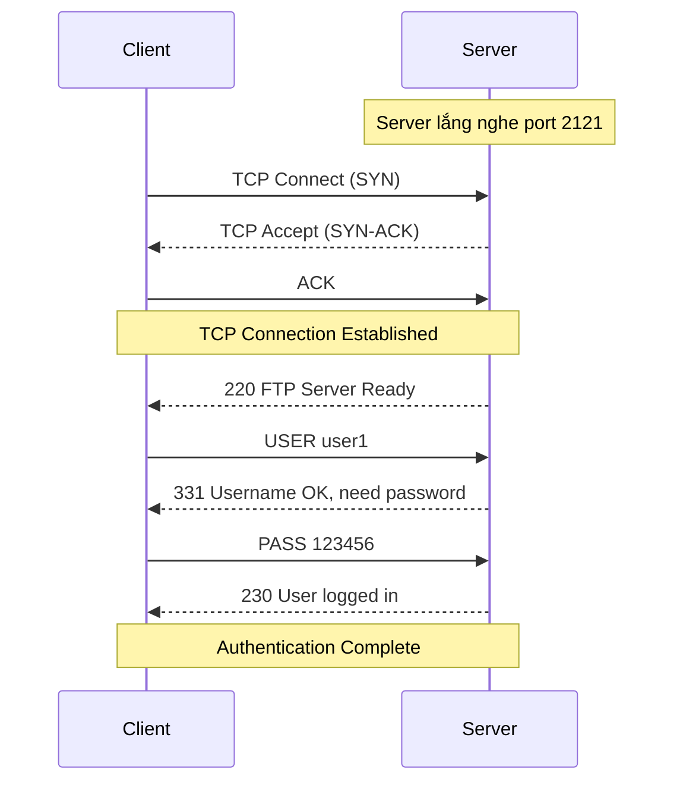
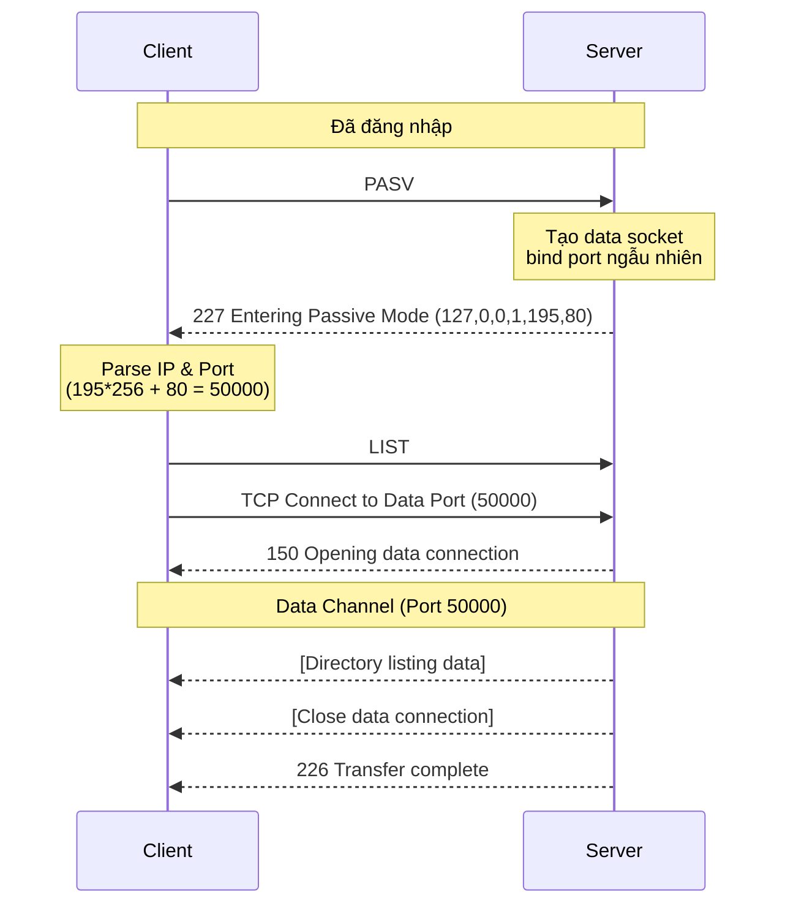
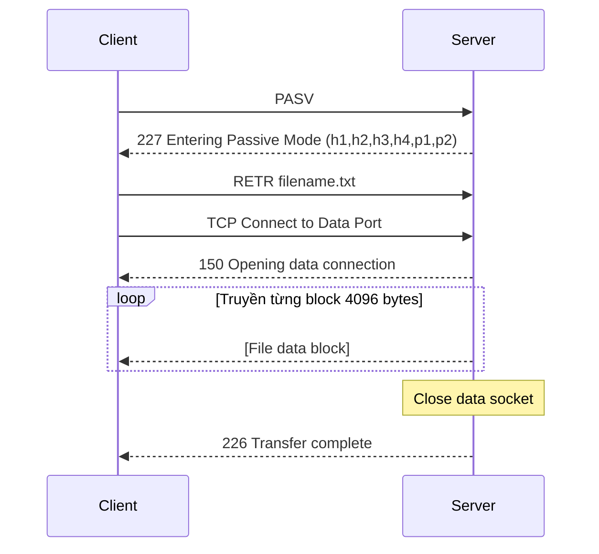
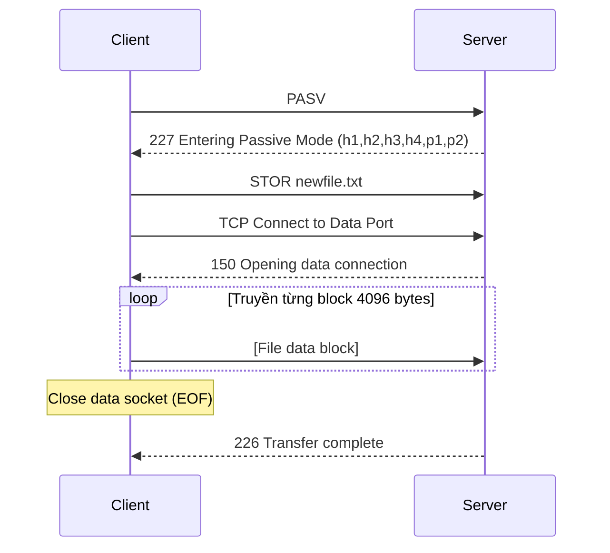
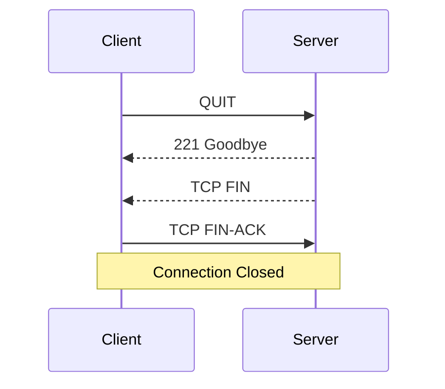

# BÁO CÁO DỰ ÁN FTP CLIENT-SERVER

## 1. Thông tin chung

### 1.1 Tên đề tài
**Xây dựng ứng dụng FTP Client-Server sử dụng Socket TCP**

### 1.2 Thành viên nhóm

| Thành viên | Phần phụ trách |
|------------|----------------|
| **Cuong** (Leader) | FTP Server core, socket, đa client, control connection |
| **Huy** | Quản lý tài khoản, file system, bảo mật thư mục |
| **Chien** | Data connection, upload/download, FTP Client |

---

## 2. Mô tả giao thức

### 2.1 Giao thức cơ bản

| Thông số | Giá trị |
|----------|---------|
| **Giao thức mạng** | TCP/IP |
| **Tiêu chuẩn** | RFC 959 (File Transfer Protocol) |
| **Port Server mặc định** | 2121 |
| **Port Client** | Ephemeral port (được OS cấp động) |
| **Chế độ truyền dữ liệu** | Passive Mode (PASV) |
| **Hỗ trợ đồng thời** | Multi-threaded (1 thread/client) |

### 2.2 Các kết nối FTP

FTP sử dụng **2 kênh kết nối riêng biệt**:

```
┌─────────────────┐                      ┌─────────────────┐
│   FTP CLIENT    │                      │   FTP SERVER    │
│                 │                      │                 │
│  ┌───────────┐  │   Control Channel    │  ┌───────────┐  │
│  │  Control  │◄─┼──────(Port 2121)─────┼─►│  Control  │  │
│  │  Socket   │  │       (TCP)          │  │  Socket   │  │
│  └───────────┘  │                      │  └───────────┘  │
│                 │                      │                 │
│  ┌───────────┐  │    Data Channel      │  ┌───────────┐  │
│  │   Data    │◄─┼───(PASV Port)────────┼─►│   Data    │  │
│  │  Socket   │  │      (TCP)           │  │  Socket   │  │
│  └───────────┘  │                      │  └───────────┘  │
└─────────────────┘                      └─────────────────┘
```

| Kênh | Mô tả | Cổng |
|------|-------|------|
| **Control Channel** | Gửi/nhận lệnh FTP và response | Server: 2121, Client: ephemeral |
| **Data Channel** | Truyền dữ liệu file, danh sách thư mục | Server: dynamic (PASV), Client: ephemeral |

---

## 3. Cấu trúc dữ liệu

### 3.1 FTP Session (Server)

```c
typedef struct {
    int session_id;             /* ID phiên duy nhất */
    int ctrl_sock;              /* Socket điều khiển */
    int logged_in;              /* Trạng thái đăng nhập */
    int account_index;          /* Chỉ số tài khoản */
    char username[50];          /* Tên người dùng */
    char current_dir[256];      /* Thư mục hiện tại */
    char root_dir[256];         /* Thư mục gốc (chroot) */
    struct sockaddr_in client_addr;  /* Địa chỉ client */
    int data_listen_sock;       /* Socket lắng nghe dữ liệu */
    int data_sock;              /* Socket kết nối dữ liệu */
} FTPSession;
```

### 3.2 FTP Client

```c
typedef struct {
    int ctrl_sock;      /* Socket điều khiển */
    char server_ip[50]; /* Địa chỉ IP server */
    int server_port;    /* Cổng server */
    int logged_in;      /* Trạng thái đăng nhập */
} FTPClient;
```

---

## 4. Đóng gói dữ liệu

### 4.1 Định dạng lệnh FTP (Client → Server)

```
<COMMAND> [<ARGUMENT>]\r\n
```

| Thành phần | Mô tả |
|------------|-------|
| `<COMMAND>` | Lệnh FTP viết hoa (VD: `USER`, `PASS`, `LIST`) |
| `<ARGUMENT>` | Tham số (tuỳ chọn) |
| `\r\n` | Ký tự kết thúc (Carriage Return + Line Feed) |

**Ví dụ:**
```
USER user1\r\n
PASS 123456\r\n
CWD documents\r\n
RETR file.txt\r\n
```

### 4.2 Định dạng phản hồi (Server → Client) 

```
<CODE> <MESSAGE>\r\n
```

| Thành phần | Mô tả |
|------------|-------|
| `<CODE>` | Mã phản hồi 3 chữ số (theo RFC 959) |
| `<MESSAGE>` | Thông điệp mô tả |
| `\r\n` | Ký tự kết thúc |

**Ví dụ:**
```
220 FTP Server Ready\r\n
331 Username OK, need password\r\n
230 User logged in\r\n
```

### 4.3 Truyền dữ liệu qua Data Channel

| Loại dữ liệu | Định dạng | Kích thước buffer |
|--------------|-----------|-------------------|
| Danh sách file (LIST) | Text format (ls -l style) | 4096 bytes |
| Nội dung file (RETR/STOR) | Binary stream | 4096 bytes/block |

---

## 5. Các lệnh FTP được hỗ trợ

### 5.1 Lệnh xác thực

| Lệnh | Cú pháp | Mô tả | Code thành công | Code lỗi |
|------|---------|-------|-----------------|----------|
| `USER` | `USER <username>` | Gửi tên đăng nhập | 331 | 501 |
| `PASS` | `PASS <password>` | Gửi mật khẩu | 230 | 530, 503 |

### 5.2 Lệnh điều hướng

| Lệnh | Cú pháp | Mô tả | Code thành công | Code lỗi |
|------|---------|-------|-----------------|----------|
| `PWD` | `PWD` | In thư mục hiện tại | 257 | 530 |
| `CWD` | `CWD <path>` | Đổi thư mục | 250 | 530, 550, 501 |
| `CDUP` | `CDUP` | Lên thư mục cha | 250 | 530, 550 |

### 5.3 Lệnh truyền dữ liệu

| Lệnh | Cú pháp | Mô tả | Code thành công | Code lỗi |
|------|---------|-------|-----------------|----------|
| `PASV` | `PASV` | Bật chế độ passive | 227 | 530, 425 |
| `LIST` | `LIST` | Liệt kê thư mục | 226 | 425, 550 |
| `RETR` | `RETR <file>` | Download file | 226 | 425, 550, 426, 450 |
| `STOR` | `STOR <file>` | Upload file | 226 | 425, 550, 426, 450 |
| `TYPE` | `TYPE <A\|I>` | Đặt chế độ truyền | 200 | 504 |

### 5.4 Lệnh hệ thống

| Lệnh | Cú pháp | Mô tả | Code thành công |
|------|---------|-------|-----------------|
| `SYST` | `SYST` | Thông tin hệ thống | 215 |
| `NOOP` | `NOOP` | Giữ kết nối | 200 |
| `QUIT` | `QUIT` | Ngắt kết nối | 221 |

---

## 6. Mã phản hồi FTP (Response Codes)

### 6.1 Phân loại mã phản hồi

| Nhóm | Ý nghĩa |
|------|---------|
| **1xx** | Positive Preliminary - Hành động đang được xử lý |
| **2xx** | Positive Completion - Thành công |
| **3xx** | Positive Intermediate - Cần thêm thông tin |
| **4xx** | Transient Negative - Lỗi tạm thời |
| **5xx** | Permanent Negative - Lỗi vĩnh viễn |

### 6.2 Chi tiết mã phản hồi được triển khai

| Mã | Thông điệp | Mô tả |
|----|------------|-------|
| `150` | Opening data connection | Bắt đầu truyền dữ liệu |
| `200` | OK / Type set to A/I | Lệnh thành công |
| `211` | End | Kết thúc danh sách tính năng |
| `215` | UNIX Type: L8 | Thông tin hệ thống |
| `220` | FTP Server Ready | Server sẵn sàng |
| `221` | Goodbye | Kết thúc phiên |
| `226` | Transfer complete | Truyền xong |
| `227` | Entering Passive Mode (h1,h2,h3,h4,p1,p2) | PASV response |
| `230` | User logged in | Đăng nhập thành công |
| `250` | Directory changed | Đổi thư mục thành công |
| `257` | "path" is current directory | Thư mục hiện tại |
| `331` | Username OK, need password | Cần mật khẩu |
| `425` | Can't open data connection | Lỗi kết nối dữ liệu |
| `426` | Connection closed; transfer aborted | Truyền bị hủy |
| `450` | Requested file action not taken | Lỗi file tạm thời |
| `501` | Syntax error | Lỗi cú pháp |
| `502` | Command not implemented | Lệnh không được hỗ trợ |
| `503` | Login with USER first | Chưa đăng nhập với USER |
| `504` | Type not supported | Type không hỗ trợ |
| `530` | Not logged in / Login incorrect | Chưa đăng nhập / Sai thông tin |
| `550` | Directory/File not found / Permission denied | Không tìm thấy / Từ chối truy cập |

---

## 7. Sequence Diagram

### 7.1 Quá trình kết nối và đăng nhập



### 7.2 Quá trình liệt kê thư mục (LIST)



### 7.3 Quá trình download file (RETR)



### 7.4 Quá trình upload file (STOR)



### 7.5 Quá trình ngắt kết nối



---

## 8. Bảo mật

### 8.1 Chroot giả (Sandboxing)

- Mỗi user có thư mục gốc riêng (`root_dir`)
- Thư mục hiện tại (`current_dir`) là đường dẫn tương đối trong `root_dir`
- Đường dẫn thực tế = `root_dir` + `current_dir`
- Không cho phép `CWD ..` khi đang ở `/`

### 8.2 Quản lý tài khoản

File `accounts.txt`:
```
username password /path/to/home
user1 123456 ./data/user1
user2 password ./data/user2
```

---

## 9. Tương thích

### 9.1 FTP Clients đã test

| Client | Hỗ trợ |
|--------|--------|
| **Custom FTP Client** (dự án) | ✅ Đầy đủ |
| **FileZilla** | ✅ (RFC 959 cơ bản) |
| **Command-line ftp** | ✅ |

### 9.2 Hạn chế

- Chỉ hỗ trợ **Passive Mode** (không có Active Mode)
- Không hỗ trợ **FTPS** (FTP over TLS)
- Không hỗ trợ **Resume** download/upload

---

## 10. Cách chạy ứng dụng

### 10.1 Build

```bash
make all
```

### 10.2 Chạy Server

```bash
./bin/ftp_server [port]
# Mặc định: port 2121
```

### 10.3 Chạy Client

```bash
./bin/ftp_client [host] [port]
# Mặc định: 127.0.0.1:2121
```

### 10.4 Tài khoản mặc định

- **Username:** user1
- **Password:** 123456

---

## 11. Cấu trúc mã nguồn

```
FTP-client-server/
├── server/
│   ├── include/
│   │   ├── account.h       # Quản lý tài khoản
│   │   └── ftp_server.h    # Định nghĩa FTP server
│   ├── src/
│   │   ├── server.c        # Main entry, multi-threading
│   │   ├── ftp_server.c    # Xử lý lệnh FTP
│   │   ├── account.c       # CRUD tài khoản
│   │   └── account_add.c   # Tool thêm tài khoản
│   ├── helpers/
│   │   ├── logger.h        # Logger header
│   │   └── logger.c        # Ghi log
│   └── data/
│       └── accounts.txt    # File tài khoản
├── client/
│   ├── include/
│   │   └── ftp_client.h    # Định nghĩa FTP client
│   └── src/
│       ├── client.c        # Main entry
│       └── ftp_client.c    # Xử lý lệnh client
├── docs/
│   └── rfc959.txt          # Tài liệu RFC 959
├── Makefile
├── README.md
└── REPORT.md
```

---

## 12. Chi tiết triển khai kỹ thuật

### 12.1 Kiến trúc Server

#### 12.1.1 Multi-threading Architecture

Server sử dụng kiến trúc **multi-threaded** với POSIX threads (pthread):

```c
// File: server/src/server.c
static int next_session_id = 0;
static pthread_mutex_t session_id_mutex = PTHREAD_MUTEX_INITIALIZER;

void *client_thread(void *arg) {
    ClientInfo *info = (ClientInfo *)arg;
    handle_client(info->client_sock, info->client_addr, info->session_id);
    free(info);
    return NULL;
}
```

**Quy trình xử lý:**
1. Main thread lắng nghe trên port 2121
2. Khi có client kết nối, `accept()` tạo socket mới
3. Tạo thread riêng biệt cho mỗi client
4. Sử dụng mutex để đảm bảo session ID duy nhất
5. Thread tự động detach sau khi tạo (`pthread_detach`)

#### 12.1.2 Session Management

Mỗi phiên FTP được quản lý qua cấu trúc `FTPSession`:

```c
typedef struct {
    int session_id;           // ID duy nhất cho mỗi phiên
    int ctrl_sock;            // Socket điều khiển (lệnh FTP)
    int logged_in;            // Trạng thái xác thực (0/1)
    int account_index;        // Chỉ số trong mảng accounts[]
    char username[50];        // Username tạm (trước khi PASS)
    char current_dir[256];    // Thư mục hiện tại (relative)
    char root_dir[256];       // Thư mục gốc (absolute path)
    struct sockaddr_in client_addr;
    int data_listen_sock;     // Socket lắng nghe PASV (-1 nếu chưa dùng)
    int data_sock;            // Socket truyền dữ liệu (-1 nếu chưa kết nối)
} FTPSession;
```

**Vòng đời session:**
- Khởi tạo khi client kết nối → gửi `220 FTP Server Ready`
- Duy trì qua vòng lặp `recv()` lệnh → `send()` response
- Kết thúc khi nhận lệnh `QUIT` hoặc client ngắt kết nối

#### 12.1.3 Account Authentication System

**Cấu trúc tài khoản:**
```c
typedef struct {
    char username[50];
    char password[50];
    char home_dir[256];
} Account;

Account accounts[MAX_ACCOUNTS];  // Mảng toàn cục
int account_count = 0;
```

**File format `accounts.txt`:**
```
user1 123456 ./server/data/user1
admin admin123 ./server/data/admin
cuong pass123 ./server/data/cuong
```

**Quy trình xác thực:**
```c
int check_login(const char *username, const char *password) {
    for (int i = 0; i < account_count; i++) {
        if (strcmp(accounts[i].username, username) == 0 &&
            strcmp(accounts[i].password, password) == 0) {
            return i;  // Trả về index trong mảng
        }
    }
    return -1;  // Sai username/password
}
```

### 12.2 Passive Mode Data Transfer

#### 12.2.1 Quá trình PASV

**Bước 1: Client gửi lệnh PASV**
```
Client → Server: PASV\r\n
```

**Bước 2: Server tạo data socket**
```c
void cmd_pasv(FTPSession *session) {
    // Tạo socket TCP
    session->data_listen_sock = socket(AF_INET, SOCK_STREAM, 0);
    
    // Bind với port = 0 → OS tự động cấp port ngẫu nhiên
    struct sockaddr_in data_addr;
    data_addr.sin_family = AF_INET;
    data_addr.sin_addr.s_addr = INADDR_ANY;
    data_addr.sin_port = 0;  // Kernel chọn port tự do
    
    bind(session->data_listen_sock, ...);
    listen(session->data_listen_sock, 1);
    
    // Lấy port được cấp
    getsockname(session->data_listen_sock, ...);
    int pasv_port = ntohs(data_addr.sin_port);
    
    // Lấy IP của server
    getsockname(session->ctrl_sock, ...);
    unsigned char *ip = (unsigned char*)&server_addr.sin_addr.s_addr;
    
    // Gửi response: 227 Entering Passive Mode (h1,h2,h3,h4,p1,p2)
    // Port = p1 * 256 + p2
    snprintf(response, sizeof(response), 
        "227 Entering Passive Mode (%d,%d,%d,%d,%d,%d)\r\n",
        ip[0], ip[1], ip[2], ip[3],
        (pasv_port >> 8) & 0xFF,
        pasv_port & 0xFF);
}
```

**Bước 3: Client parse response và kết nối**
```c
// Client parse PASV response
int parse_pasv_response(const char *response, char *ip, int *port) {
    int h1, h2, h3, h4, p1, p2;
    const char *start = strchr(response, '(');
    sscanf(start, "(%d,%d,%d,%d,%d,%d)", &h1, &h2, &h3, &h4, &p1, &p2);
    
    sprintf(ip, "%d.%d.%d.%d", h1, h2, h3, h4);
    *port = p1 * 256 + p2;  // Tính port từ p1, p2
    return 0;
}
```

#### 12.2.2 File Download (RETR)

**Timeline:**
```
1. Client: PASV              → Server: 227 ...
2. Client: RETR file.txt     → Server: 150 Opening data connection
3. Client → Server: TCP Connect to data port
4. Server: accept() data connection
5. Server → Client: [File content blocks, 4096 bytes/read]
6. Server: close(data_sock)
7. Server → Client: 226 Transfer complete
```

**Implementation:**
```c
void cmd_retr(FTPSession *session, const char *filename) {
    // Tạo đường dẫn tuyệt đối
    char filepath[MAX_PATH_LEN];
    snprintf(filepath, sizeof(filepath), "%s%s/%s", 
        session->root_dir, session->current_dir, filename);
    
    // Mở file
    FILE *fp = fopen(filepath, "rb");
    if (fp == NULL) {
        send_response(session->ctrl_sock, "550 File not found\r\n");
        return;
    }
    
    // Chấp nhận kết nối data
    int dsock = accept_data_connection(session);
    send_response(session->ctrl_sock, "150 Opening data connection\r\n");
    
    // Truyền file từng block 4096 bytes
    char buffer[BUFFER_SIZE];  // 4096
    size_t bytes_read;
    while ((bytes_read = fread(buffer, 1, sizeof(buffer), fp)) > 0) {
        send(dsock, buffer, bytes_read, 0);
    }
    
    fclose(fp);
    close(dsock);
    send_response(session->ctrl_sock, "226 Transfer complete\r\n");
}
```

**Error Handling:**
- `426 Connection closed; transfer aborted` - Nếu `send()` thất bại
- `450 Requested file action not taken` - Nếu `ferror(fp)` xảy ra lỗi I/O
- `550 File not found` - Nếu `fopen()` thất bại

#### 12.2.3 File Upload (STOR)

**Implementation:**
```c
void cmd_stor(FTPSession *session, const char *filename) {
    // Tạo đường dẫn
    char filepath[MAX_PATH_LEN];
    snprintf(filepath, sizeof(filepath), "%s%s/%s", 
        session->root_dir, session->current_dir, filename);
    
    // Chấp nhận kết nối data
    int dsock = accept_data_connection(session);
    
    // Mở file để ghi (binary mode)
    FILE *fp = fopen(filepath, "wb");
    if (fp == NULL) {
        close(dsock);
        if (errno == EACCES || errno == EPERM) {
            send_response(session->ctrl_sock, "450 Requested file action not taken\r\n");
        } else {
            send_response(session->ctrl_sock, "550 Cannot create file\r\n");
        }
        return;
    }
    
    send_response(session->ctrl_sock, "150 Opening data connection\r\n");
    
    // Nhận file từng block
    char buffer[BUFFER_SIZE];
    ssize_t bytes_recv;
    while ((bytes_recv = recv(dsock, buffer, sizeof(buffer), 0)) > 0) {
        fwrite(buffer, 1, bytes_recv, fp);
    }
    
    fclose(fp);
    close(dsock);
    
    // Nếu có lỗi, xóa file không hoàn chỉnh
    if (bytes_recv < 0 || io_error) {
        unlink(filepath);
        send_response(session->ctrl_sock, "426 Connection closed; transfer aborted\r\n");
    } else {
        send_response(session->ctrl_sock, "226 Transfer complete\r\n");
    }
}
```

### 12.3 Directory Navigation với Chroot Sandbox

#### 12.3.1 Cơ chế Chroot giả

**Nguyên tắc:**
- `root_dir`: Đường dẫn tuyệt đối trên hệ thống (VD: `./server/data/user1`)
- `current_dir`: Đường dẫn tương đối trong sandbox (VD: `/documents`)
- **Đường dẫn thực tế** = `root_dir` + `current_dir`

**Ví dụ:**
```
User: user1
root_dir: ./server/data/user1
current_dir: /

CWD documents → current_dir = /documents
Đường dẫn thực: ./server/data/user1/documents

CWD .. → current_dir = /
CWD .. (tại root) → 550 Permission denied  (Không cho escape)
```

#### 12.3.2 Path Resolution Logic

```c
void cmd_cwd(FTPSession *session, const char *arg) {
    char new_path[MAX_PATH_LEN];
    
    if (arg[0] == '/') {
        // Đường dẫn tuyệt đối (trong sandbox)
        strncpy(new_path, arg, sizeof(new_path) - 1);
    } else if (strcmp(arg, "..") == 0) {
        // Lên thư mục cha
        if (strcmp(session->current_dir, "/") == 0) {
            send_response(session->ctrl_sock, "550 Permission denied\r\n");
            return;  // CHẶN escape khỏi root
        }
        strncpy(new_path, session->current_dir, sizeof(new_path) - 1);
        char *last_slash = strrchr(new_path, '/');
        if (last_slash != NULL) {
            *last_slash = '\0';
        }
    } else {
        // Đường dẫn tương đối
        snprintf(new_path, sizeof(new_path), "%s/%s", 
            session->current_dir, arg);
    }
    
    // Kiểm tra thư mục tồn tại
    char full_path[MAX_PATH_LEN];
    snprintf(full_path, sizeof(full_path), "%s%s", 
        session->root_dir, new_path);
    
    struct stat st;
    if (stat(full_path, &st) == 0 && S_ISDIR(st.st_mode)) {
        strncpy(session->current_dir, new_path, sizeof(session->current_dir) - 1);
        send_response(session->ctrl_sock, "250 Directory changed\r\n");
    } else {
        send_response(session->ctrl_sock, "550 Directory not found\r\n");
    }
}
```

### 12.4 LIST Command Implementation

**Format output:** Tương tự `ls -l` trên Unix

```c
void cmd_list(FTPSession *session) {
    char full_path[MAX_PATH_LEN];
    snprintf(full_path, sizeof(full_path), "%s%s", 
        session->root_dir, session->current_dir);
    
    DIR *dir = opendir(full_path);
    struct dirent *entry;
    
    while ((entry = readdir(dir)) != NULL) {
        if (strcmp(entry->d_name, ".") == 0 || strcmp(entry->d_name, "..") == 0)
            continue;
        
        char filepath[MAX_PATH_LEN];
        snprintf(filepath, sizeof(filepath), "%s/%s", full_path, entry->d_name);
        
        struct stat st;
        stat(filepath, &st);
        
        // Tạo chuỗi permission
        char perms[11] = "----------";
        perms[0] = S_ISDIR(st.st_mode) ? 'd' : '-';
        perms[1] = (st.st_mode & S_IRUSR) ? 'r' : '-';
        perms[2] = (st.st_mode & S_IWUSR) ? 'w' : '-';
        perms[3] = (st.st_mode & S_IXUSR) ? 'x' : '-';
        // ... tương tự cho group và others
        
        // Format: -rw-r--r-- 1 ftp ftp 1234 Jan 15 14:30 file.txt
        snprintf(line, sizeof(line), 
            "%s 1 ftp ftp %8ld %3s %2d %02d:%02d %s\r\n",
            perms, (long)st.st_size, month_name, day, hour, min, 
            entry->d_name);
        
        send(dsock, line, strlen(line), 0);
    }
    closedir(dir);
}
```

### 12.5 Logging System

**File:** `server/helpers/logger.c`

Mỗi lệnh được log với format:
```
[YYYY-MM-DD HH:MM:SS] [SID=123] [IP] COMMAND argument
```

**Ví dụ log:**
```
[2024-12-27 14:35:20] [SID=1] [127.0.0.1] USER user1
[2024-12-27 14:35:22] [SID=1] [127.0.0.1] PASS ****
[2024-12-27 14:35:25] [SID=1] [127.0.0.1] LIST
```

### 12.6 Client Implementation

**Command Mapping:**
```
User input     → FTP Command
-----------      ------------
pwd            → PWD
cd <dir>       → CWD <dir>
ls             → PASV + LIST
get <file>     → PASV + TYPE I + RETR <file>
put <file>     → PASV + TYPE I + STOR <file>
quit           → QUIT
```

**Client-side PASV flow:**
```c
int ftp_retr(FTPClient *client, const char *filename, ...) {
    // 1. Mở data connection
    int data_sock = open_data_connection(client);  // Gửi PASV, parse response, connect
    
    // 2. Set binary mode
    ftp_send_cmd(client, "TYPE I");
    
    // 3. Gửi RETR
    snprintf(cmd, sizeof(cmd), "RETR %s", filename);
    ftp_send_cmd(client, cmd);
    
    // 4. Nhận dữ liệu từ data socket
    FILE *fp = fopen(local_path, "wb");
    while ((bytes = recv(data_sock, buffer, BUFFER_SIZE, 0)) > 0) {
        fwrite(buffer, 1, bytes, fp);
    }
    fclose(fp);
    close(data_sock);
    
    // 5. Nhận 226 Transfer complete
    ftp_recv_response(client, response, sizeof(response));
}
```

### 12.7 Error Recovery

**Connection Errors:**
- Server đóng `data_sock` sau mỗi lệnh LIST/RETR/STOR
- Client phải gọi PASV lại cho mỗi lệnh truyền dữ liệu
- Nếu `accept()` timeout → `425 Can't open data connection`

**File Transfer Errors:**
- Upload bị gián đoạn → server xóa file bằng `unlink(filepath)`
- Download bị gián đoạn → client nhận file không đầy đủ (không có resume)

### 12.8 Thread Safety

**Shared Resources:**
- `accounts[]` array: **Read-only** sau khi `load_accounts()` → Thread-safe
- `next_session_id`: Protected bởi `pthread_mutex_t session_id_mutex`
- Logger: Mỗi thread ghi log độc lập (file I/O là atomic với append mode)

### 12.9 Performance Characteristics

**Buffer Sizes:**
- Control channel: `CMD_SIZE = 512` bytes (đủ cho lệnh FTP)
- Data channel: `BUFFER_SIZE = 4096` bytes (tối ưu cho file I/O)

**Connection Limits:**
- Listen backlog: `10` connections (tham số `listen()`)
- Concurrent clients: Không giới hạn (phụ thuộc tài nguyên hệ thống)
- Max accounts: `MAX_ACCOUNTS = 100`

---

## 13. Kết luận

Dự án đã triển khai thành công một hệ thống FTP Client-Server hoàn chỉnh theo chuẩn RFC 959 với các tính năng:

- ✅ Đa luồng xử lý nhiều client đồng thời
- ✅ Xác thực tài khoản với file credentials
- ✅ Truyền file upload/download qua Passive Mode
- ✅ Điều hướng thư mục với bảo mật chroot giả
- ✅ Tương thích với FileZilla và các FTP client chuẩn
- ✅ Ghi log chi tiết với timestamp và session ID
- ✅ Error handling toàn diện cho network và file I/O
- ✅ Thread-safe architecture với mutex synchronization

**Điểm mạnh:**
- Kiến trúc rõ ràng, dễ bảo trì
- Tuân thủ chặt chẽ RFC 959
- Xử lý lỗi chi tiết với response codes chuẩn
- Logging đầy đủ cho debugging

**Hạn chế và hướng phát triển:**
- Thêm Active Mode (PORT command)
- Hỗ trợ FTPS/TLS encryption
- Resume transfer (REST command)
- Quotas và rate limiting
- IPv6 support

---

*Báo cáo được tạo ngày: 27/12/2024*
